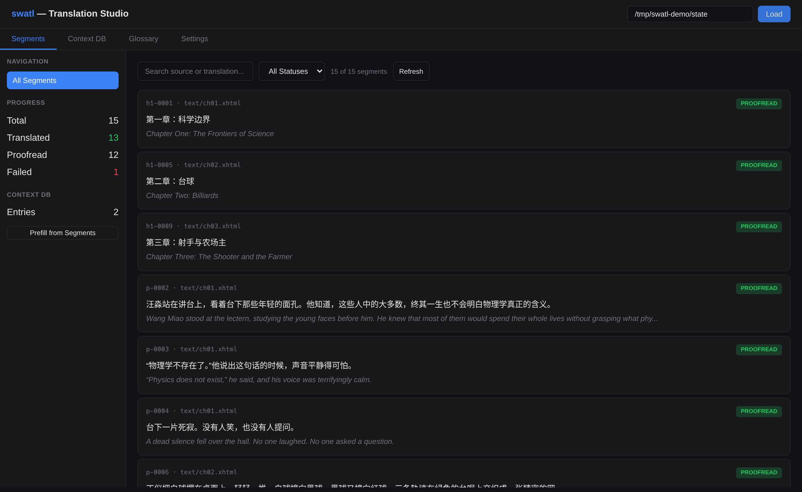
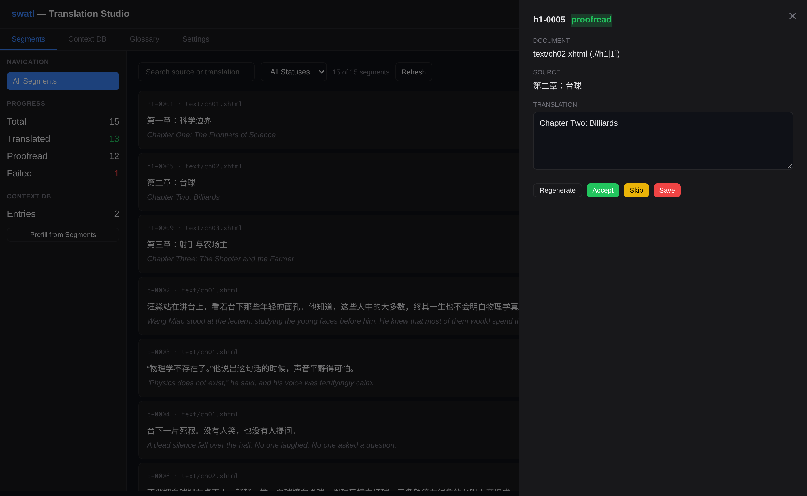
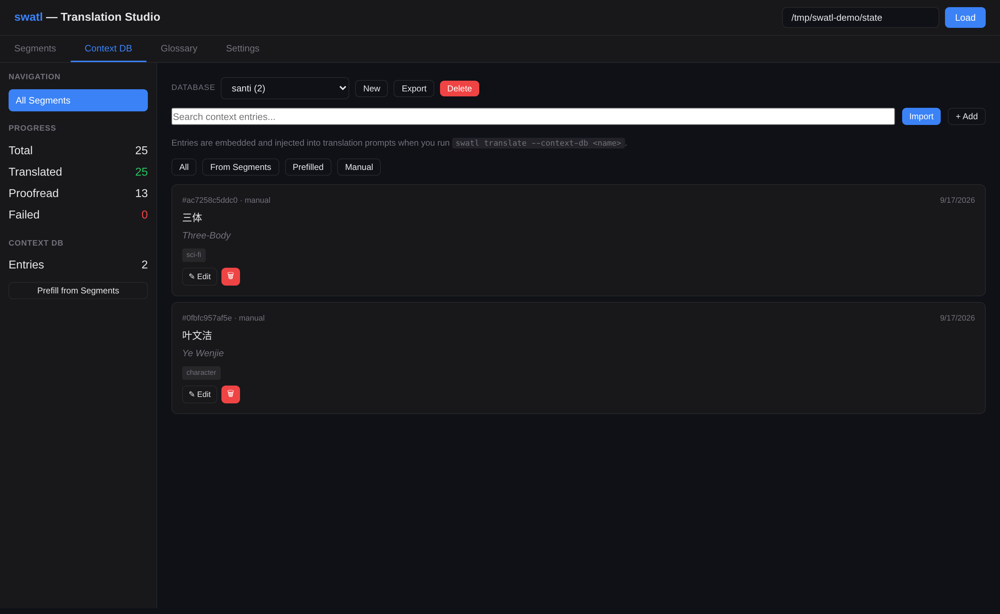

# swatl

**An AI translation and proofreading studio for EPUB e-books.**

[](https://github.com/Gishi1/swatl/actions/workflows/ci.yml)
[](https://www.python.org/)
[](LICENSE)
[](https://ko-fi.com/gishi)

swatl reads an EPUB, extracts its translatable text, translates it with a
pluggable LLM backend, runs a proofreading pass, audits the result, and writes a
new EPUB — preserving every image, stylesheet, font and other non-text asset
byte-for-byte. The MVP language pair is **Chinese → English**; Japanese → English
is supported, and new pairs are a configuration change rather than a code change.



## Table of contents

- [Features](#features)
- [Installation](#installation)
- [Quick start](#quick-start)
- [Web GUI](#web-gui)
- [CLI reference](#cli-reference)
- [How it works](#how-it-works)
- [Configuration](#configuration)
- [Supported providers](#supported-providers)
- [Development](#development)
- [Validating an export](#validating-an-export)
- [Context databases](#context-databases)
- [Known limitations](#known-limitations)
- [Support](#support)
- [License](#license)

## Features

| | |
|---|---|
| **Segment-level translation** | Per-segment checkpoints; interrupted runs resume where they stopped. |
| **Pluggable backends** | OpenAI, DeepSeek, Anthropic, DashScope or a local Ollama server — plus an offline `mock` provider for testing. |
| **Glossary control** | Pin terminology once and apply it consistently across the whole book. |
| **Proofreading pass** | A second LLM pass for grammar, style and naturalness. |
| **Quality audit** | CJK-residue, omission and glossary-compliance heuristics. |
| **Interactive review** | Search, filter, edit, accept, skip or requeue individual segments in the browser. |
| **Semantic context injection** | Curated entries are embedded (Ollama by default) and the nearest ones are added to every translation prompt. |
| **Translation memory** | Disk-backed cache, reused across runs and books. |
| **Style guides** | Formal, casual, literary or technical register. |
| **Bilingual export** | Parallel source/target EPUB for side-by-side reading. |
| **Back-translation QA** | Sample-based verification that re-translates to the source language and scores similarity. |
| **Cost visibility** | Token estimates and USD projections before you spend anything. |

## Installation

Requires **Python 3.11+** and [`uv`](https://docs.astral.sh/uv/).

```bash
git clone https://github.com/Gishi1/swatl.git
cd swatl
uv sync
```

Embeddings are served by Ollama or any OpenAI-compatible endpoint, so no ML
runtime is installed in-process: a full install is roughly 370 MB.


To try the pipeline without any API key or network access, use the bundled
offline provider:

```bash
uv run swatl translate book.epub --provider mock --state ./state
```

## Quick start

```bash
# 1. Configure a provider (only needed for real translation)
mkdir -p ~/.config/swatl
cp config/providers.example.toml ~/.config/swatl/providers.toml
export DEEPSEEK_API_KEY=sk-...      # the variable named by api_key_env

# 2. Translate a book
uv run swatl translate book.epub --target en --provider deepseek --state ./state

# 3. Proofread, then audit
uv run swatl proofread --state ./state --provider deepseek
uv run swatl audit --state ./state

# 4. Review and edit in the browser
uv run swatl web --port 8080

# 5. Export the translated EPUB
uv run swatl export --state ./state -o translated.epub
```

`mock` is the offline provider used by the test suite. It translates CJK
deterministically and needs no credentials, which makes it the fastest way to
verify an installation end-to-end.

### Advanced usage

```bash
# Bilingual export (source and target side by side)
uv run swatl export --state ./state --bilingual -o bilingual.epub

# Reuse translations across runs
uv run swatl translate book.epub --translation-memory ./tm.json --state ./state

# Literary register, with a glossary
uv run swatl translate book.epub --style literary --glossary ./glossary.toml --state ./state

# Back-translation quality check (requires a real LLM)
uv run swatl back-translate --state ./state --provider deepseek --sample 20

# Language-aware audit for a Japanese source
uv run swatl audit --state ./state --source-lang ja

# Translate with the context database's entries injected into the prompts
uv run swatl translate book.epub --context-db santi --state ./state
uv run swatl translate book.epub --no-context --state ./state
```

## Web GUI

`uv run swatl web` serves a single-page studio on `http://127.0.0.1:8080`.

| Tab | Purpose |
|---|---|
| **Segments** | Server-side search and status filtering, pagination, and a detail panel for editing, accepting, skipping or requeueing a segment |
| **Context DB** | Create, switch, export and delete named context databases; add, edit, delete, import text/JSON/CSV/HTML entries, or prefill from translated segments |
| **Context-aware translation** | Entries from the selected database are embedded and injected into each translation prompt as related terminology and reference passages |
| **Glossary** | Manage term → translation pairs stored with the book's state |
| **Settings** | Inspect configured providers, add one, and switch the active state directory |





The active state directory is remembered in `localStorage` and reloaded
automatically. State directories travel as query parameters, so nested and
absolute paths work. Read-only endpoints never create directories on disk, and
the layout adapts to narrow viewports.

### HTTP API

The GUI is a thin client over a small JSON API. Every endpoint takes
`state_dir` as a query parameter.

| Method | Path | Purpose |
|---|---|---|
| `GET` | `/api/run` | Run metadata (`run.json`) |
| `GET` | `/api/segments` | Paginated segments (`status`, `q`, `page`, `page_size`) |
| `GET` | `/api/segment/{id}` | A single segment |
| `GET` | `/api/stats` | Per-status counts |
| `PATCH` | `/api/segment/{id}` | Update a translation or status |
| `POST` | `/api/accept/{id}`, `/api/skip/{id}`, `/api/regenerate/{id}` | Review actions |
| `GET`/`POST`/`PATCH`/`DELETE` | `/api/context…` | Context DB CRUD, search, stats, import, prefill (`db` selects the database) |
| `GET`/`POST`/`DELETE` | `/api/context/databases…` | List, create, copy or delete context databases |
| `GET` | `/api/context/export` | Download a database as JSON or CSV |
| `GET`/`POST`/`DELETE` | `/api/glossary…` | Glossary CRUD |
| `GET`/`POST` | `/api/config` | List or add providers |

## CLI reference

| Command | Description |
|---|---|
| `swatl inspect <epub>` | EPUB metadata, segment count and token/cost estimates |
| `swatl translate <epub>` | Translate a book (glossary, TM, style, context DB, `--dry-run`) |
| `swatl proofread` | Second-pass refinement of translated segments |
| `swatl review` | Interactive review (`-y` to auto-accept) |
| `swatl audit` | Quality audit |
| `swatl export` | Write the translated EPUB (`--bilingual` for a parallel edition) |
| `swatl back-translate` | Back-translation quality verification |
| `swatl config <name>` | Show a provider's settings |
| `swatl glossary-init` | Create a glossary file |
| `swatl glossary-add <file>` | Add a term to a glossary |
| `swatl context list` | List the context databases in a state directory |
| `swatl context create <name>` | Create a context database (`--copy-from` to clone one) |
| `swatl context delete <name>` | Delete a named context database |
| `swatl context export` | Export a database to JSON or CSV (`-o -` for stdout) |
| `swatl context import <file>` | Import JSON, CSV, HTML or text into a database |
| `swatl context stats` | Entry counts and tags for a database |
| `swatl web` | Launch the web GUI |

## How it works

```
EPUB ─▶ ingest ─▶ segments ─▶ translate ─▶ proofread ─▶ review ─▶ audit ─▶ export ─▶ EPUB
                                   │            │
                          translation memory   glossary · style guide · cost tracking
```

```
src/swatl/
├── ingest/       EPUB unzip, OPF parsing, segmentation and XPath anchors
├── providers/    OpenAI-compatible client + offline mock provider
├── translate/    batching, concurrency, retries, prompting, translation memory
├── proofread/    second-pass refinement
├── review/       interactive review session
├── audit/        quality heuristics
├── quality/      back-translation sampling
├── context/      embedding index and retrieval (FAISS + Ollama/OpenAI embedders)
├── context_db/   curated context entries (CRUD and import)
├── state/        append-only JSONL checkpoints with last-write-wins semantics
├── writeback/    in-place text replacement and EPUB re-zip
└── web/          FastAPI application and single-page UI
```

Translation is deliberately non-destructive. Segments carry an XPath anchor to
the exact text node they came from, and export rewrites only that node — images,
CSS, fonts and markup structure are copied through untouched. Export also
updates `lang`/`xml:lang` and the package document's `<dc:language>`, and writes
a spec-compliant `mimetype` entry so the result opens in Calibre, Apple Books
and browsers alike.

## Configuration

Provider configs are read from the first of:

1. `~/.config/swatl/providers.toml`
2. `./config/providers.toml`
3. `./providers.toml`

API keys are never stored in these files — only the name of the environment
variable that holds them. An **empty** `api_key_env` means the endpoint needs no
authentication (Ollama, LM Studio, a LAN gateway): no `Authorization` header is
sent and nothing has to be exported. See
[`config/providers.example.toml`](config/providers.example.toml).

```toml
[omniroute]
type = "openai-compatible"
base_url = "http://gateway-host:20128/v1"
model = "auto/cheap"
api_key_env = ""
```

## Supported providers

| Provider | Type | Notes |
|---|---|---|
| **DeepSeek** | Cloud (OpenAI-compatible) | `deepseek-chat` — inexpensive and strong at Chinese |
| **OpenAI** | Cloud (OpenAI-compatible) | `gpt-4o` |
| **Anthropic** | Cloud (OpenAI-compatible) | `claude-sonnet-4` via Anthropic's compatibility endpoint |
| **Ollama** | Local | `qwen2.5:32b` recommended for Chinese |
| **DashScope** | Cloud (OpenAI-compatible) | `qwen3-mt`, a translation-specific model |
| **mock** | Offline | Deterministic, credential-free; used by the test suite |

Any endpoint that speaks the OpenAI chat-completions API works by adding a
provider entry — including multi-model gateways such as Omniroute and LiteLLM,
which can route one model name across many upstream providers. Two details make
this seamless: swatl always asks for a non-streaming response but will assemble
an SSE stream if a gateway ignores that, and leaving `api_key_env` empty means
"no authentication", so local gateways need no dummy key.

## Development

```bash
uv sync --extra dev

uv run pytest -q                 # test suite
uv run ruff check .              # lint
uv run ruff format --check .     # format check
```

The suite includes browser-driven end-to-end tests under `tests/e2e/`. They are
optional and skip themselves when Playwright is not installed:

```bash
uv sync --extra e2e
uv run playwright install chromium
uv run pytest tests/e2e -q
```

### Validating an export

```bash
ebook-meta translated.epub              # should report the target language
ebook-convert translated.epub out.txt   # full parse by Calibre
```

### Project stats

| Metric | Value |
|---|---|
| Source | 39 Python files, ~6.5k lines across 13 modules |
| Tests | 421, including 9 browser end-to-end tests |
| Lint / format | `ruff check` and `ruff format --check` clean |
| Language pairs | zh↔en, ja↔en (extensible) |
| CLI commands | 12 |

## Context databases

A state directory holds one or more named **context databases** used to curate
terminology, style notes and reference material for a book. `default` is the
historical `context_db/entries.json`; any other name lives beside it as
`context_db/<name>.json`.

```bash
# Start a database for a series and copy an existing one into it
uv run swatl context create santi --state ./state
uv run swatl context create santi-2 --state ./state --copy-from santi

uv run swatl context list  --state ./state
uv run swatl context stats --state ./state --db santi

# Round-trip a database through a file (JSON keeps ids, types and tags)
uv run swatl context export --state ./state --db santi -o santi.json
uv run swatl context import santi.json --state ./other-book --db santi

# CSV works with spreadsheets; `-o -` writes to stdout
uv run swatl context export --state ./state --db santi --format csv -o -
```

In the web GUI the **Context DB** tab has the same controls: a database
selector plus New, Export and Delete. Deleting is refused for `default`, and
imports always target the database currently selected.

### Using a database during translation

Entries are embedded and the semantically nearest ones are injected into each
translation prompt, so curated terminology and reference passages actually
affect the output:

```bash
uv run swatl translate book.epub --context-db santi --state ./state
```

The run prints which backend it used, for example:

```
Context: 5 entries from 'santi' (from the [embedding] config section, ollama:bge-m3)
```

Retrieval is on by default when the selected database has entries; `--no-context`
turns it off, and `--embedding-backend` / `--embedding-model` / `--embedding-url`
override the backend for one run. If the embedding backend is unreachable the
translation continues without context rather than failing.

### Choosing an embedding backend

| Backend | Notes |
|---|---|
| `ollama` (default) | No API key and no download beyond `ollama pull bge-m3`. `bge-m3` is 1024-dim and handles Chinese well. |
| `openai` | Any OpenAI-compatible `/v1/embeddings` endpoint, including a local server such as LM Studio; needs `api_key`/`api_key_env`. |

Configure it in the providers file, or let swatl auto-detect a reachable
Ollama server:

```toml
[embedding]
backend = "ollama"
model = "bge-m3"
base_url = "http://127.0.0.1:11434"
```

The same settings can come from `SWATL_EMBEDDING_BACKEND`,
`SWATL_EMBEDDING_MODEL`, `SWATL_EMBEDDING_URL` and `SWATL_EMBEDDING_API_KEY`.

## Known limitations

- The quality audit is heuristic: it flags likely problems, it does not prove correctness.
- Back-translation similarity is lexical overlap, not a learned metric.
- EPUB2 NCX (`toc.ncx`) navigation labels are not translated; EPUB3 navigation documents are.
- Context-aware retrieval needs an embedding backend; the Ollama default requires `ollama pull bge-m3` (about 1.2 GB). Without one, translation still runs, minus the injected context.
- The web GUI targets a single local user: it binds to `127.0.0.1` and has no authentication.

### What gets translated

Spine documents, the EPUB3 navigation document, and `<head><title>` elements.
Within a document, text is handled per text node: an element's own text, the
text of common inline elements (`em`, `strong`, `a`, `span`, `b`, `i`, `sup`, …),
and the text that follows them. Everything else is copied through unchanged.

## Support

swatl is built and maintained in my own time and is free to use under the MIT
licence. If it saved you some work, you can buy me a coffee — it is appreciated
and it funds the model credits I use to test new language pairs.

[](https://ko-fi.com/gishi)

## License

MIT — see [LICENSE](LICENSE).
